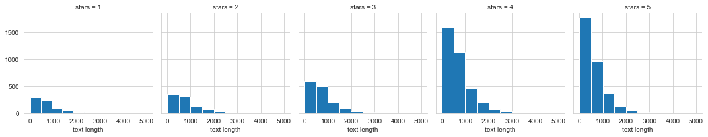
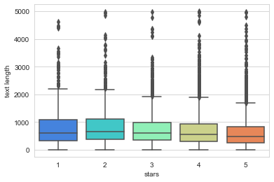
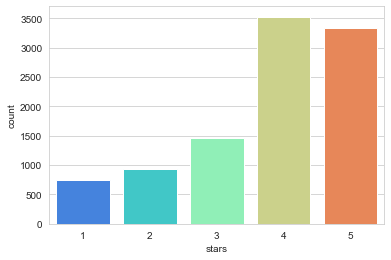
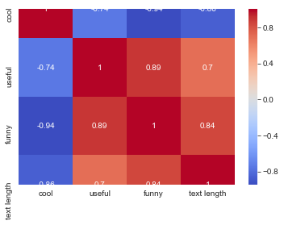

# Natural Language Processing 

## Data 

The data is from Kaggle, yelp review , each observation in this dataset is a review of a particular business by a particular user.


The "stars" column is the number of stars (1 through 5) assigned by the reviewer to the business. (Higher stars is better.) In other words, it is the rating of the business by the person who wrote the review.

The "cool" column is the number of "cool" votes this review received from other Yelp users. 

All reviews start with 0 "cool" votes, and there is no limit to how many "cool" votes a review can receive. In other words, it is a rating of the review itself, not a rating of the business.

The "useful" and "funny" columns are similar to the "cool" column.


```python
# Imports

import numpy as np
import pandas as pd
```


```python
yelp = pd.read_csv('yelp.csv')
```


```python
yelp.head()
```


<div>
<style scoped>
    .dataframe tbody tr th:only-of-type {
        vertical-align: middle;
    }

    .dataframe tbody tr th {
        vertical-align: top;
    }

    .dataframe thead th {
        text-align: right;
    }
</style>
<table border="1" class="dataframe">
  <thead>
    <tr style="text-align: right;">
      <th></th>
      <th>business_id</th>
      <th>date</th>
      <th>review_id</th>
      <th>stars</th>
      <th>text</th>
      <th>type</th>
      <th>user_id</th>
      <th>cool</th>
      <th>useful</th>
      <th>funny</th>
    </tr>
  </thead>
  <tbody>
    <tr>
      <td>0</td>
      <td>9yKzy9PApeiPPOUJEtnvkg</td>
      <td>2011-01-26</td>
      <td>fWKvX83p0-ka4JS3dc6E5A</td>
      <td>5</td>
      <td>My wife took me here on my birthday for breakf...</td>
      <td>review</td>
      <td>rLtl8ZkDX5vH5nAx9C3q5Q</td>
      <td>2</td>
      <td>5</td>
      <td>0</td>
    </tr>
    <tr>
      <td>1</td>
      <td>ZRJwVLyzEJq1VAihDhYiow</td>
      <td>2011-07-27</td>
      <td>IjZ33sJrzXqU-0X6U8NwyA</td>
      <td>5</td>
      <td>I have no idea why some people give bad review...</td>
      <td>review</td>
      <td>0a2KyEL0d3Yb1V6aivbIuQ</td>
      <td>0</td>
      <td>0</td>
      <td>0</td>
    </tr>
    <tr>
      <td>2</td>
      <td>6oRAC4uyJCsJl1X0WZpVSA</td>
      <td>2012-06-14</td>
      <td>IESLBzqUCLdSzSqm0eCSxQ</td>
      <td>4</td>
      <td>love the gyro plate. Rice is so good and I als...</td>
      <td>review</td>
      <td>0hT2KtfLiobPvh6cDC8JQg</td>
      <td>0</td>
      <td>1</td>
      <td>0</td>
    </tr>
    <tr>
      <td>3</td>
      <td>_1QQZuf4zZOyFCvXc0o6Vg</td>
      <td>2010-05-27</td>
      <td>G-WvGaISbqqaMHlNnByodA</td>
      <td>5</td>
      <td>Rosie, Dakota, and I LOVE Chaparral Dog Park!!...</td>
      <td>review</td>
      <td>uZetl9T0NcROGOyFfughhg</td>
      <td>1</td>
      <td>2</td>
      <td>0</td>
    </tr>
    <tr>
      <td>4</td>
      <td>6ozycU1RpktNG2-1BroVtw</td>
      <td>2012-01-05</td>
      <td>1uJFq2r5QfJG_6ExMRCaGw</td>
      <td>5</td>
      <td>General Manager Scott Petello is a good egg!!!...</td>
      <td>review</td>
      <td>vYmM4KTsC8ZfQBg-j5MWkw</td>
      <td>0</td>
      <td>0</td>
      <td>0</td>
    </tr>
  </tbody>
</table>
</div>


```python
yelp.info()
```

    <class 'pandas.core.frame.DataFrame'>
    RangeIndex: 10000 entries, 0 to 9999
    Data columns (total 10 columns):
    business_id    10000 non-null object
    date           10000 non-null object
    review_id      10000 non-null object
    stars          10000 non-null int64
    text           10000 non-null object
    type           10000 non-null object
    user_id        10000 non-null object
    cool           10000 non-null int64
    useful         10000 non-null int64
    funny          10000 non-null int64
    dtypes: int64(4), object(6)
    memory usage: 781.4+ KB


```python
yelp.describe()
```


<div>
<style scoped>
    .dataframe tbody tr th:only-of-type {
        vertical-align: middle;
    }

    .dataframe tbody tr th {
        vertical-align: top;
    }

    .dataframe thead th {
        text-align: right;
    }
</style>
<table border="1" class="dataframe">
  <thead>
    <tr style="text-align: right;">
      <th></th>
      <th>stars</th>
      <th>cool</th>
      <th>useful</th>
      <th>funny</th>
    </tr>
  </thead>
  <tbody>
    <tr>
      <td>count</td>
      <td>10000.000000</td>
      <td>10000.000000</td>
      <td>10000.000000</td>
      <td>10000.000000</td>
    </tr>
    <tr>
      <td>mean</td>
      <td>3.777500</td>
      <td>0.876800</td>
      <td>1.409300</td>
      <td>0.701300</td>
    </tr>
    <tr>
      <td>std</td>
      <td>1.214636</td>
      <td>2.067861</td>
      <td>2.336647</td>
      <td>1.907942</td>
    </tr>
    <tr>
      <td>min</td>
      <td>1.000000</td>
      <td>0.000000</td>
      <td>0.000000</td>
      <td>0.000000</td>
    </tr>
    <tr>
      <td>25%</td>
      <td>3.000000</td>
      <td>0.000000</td>
      <td>0.000000</td>
      <td>0.000000</td>
    </tr>
    <tr>
      <td>50%</td>
      <td>4.000000</td>
      <td>0.000000</td>
      <td>1.000000</td>
      <td>0.000000</td>
    </tr>
    <tr>
      <td>75%</td>
      <td>5.000000</td>
      <td>1.000000</td>
      <td>2.000000</td>
      <td>1.000000</td>
    </tr>
    <tr>
      <td>max</td>
      <td>5.000000</td>
      <td>77.000000</td>
      <td>76.000000</td>
      <td>57.000000</td>
    </tr>
  </tbody>
</table>
</div>


Creating a new column named "text length", represents the number of words in the 'text' column.


```python
yelp['text length'] = yelp['text'].apply(len)
```

# EDA


```python
import matplotlib.pyplot as plt
import seaborn as sns
sns.set_style('white')
%matplotlib inline
```

Creating a grid of 5 hsitograms of text length based off of the star ratings. Reference the seaborn documentation for hints on this.


```python
sns.set_style('whitegrid')
g = sns.FacetGrid(yelp, col='stars')
g.map(plt.hist, 'text length')
```


    <seaborn.axisgrid.FacetGrid at 0x7fa4e4e91350>





Boxplot of 'text length' for each 'star' category


```python
sns.boxplot(x='stars',y='text length',data=yelp,palette='rainbow')
```


    <matplotlib.axes._subplots.AxesSubplot at 0x7fa4e4ed1fd0>





**Countplot of the number of occurrences for each type of star rating.**


```python
sns.countplot(x='stars',data=yelp,palette='rainbow')
```


    <matplotlib.axes._subplots.AxesSubplot at 0x7fa4e52dc7d0>





```python
stars = yelp.groupby('stars').mean()
stars
```


<div>
<style scoped>
    .dataframe tbody tr th:only-of-type {
        vertical-align: middle;
    }

    .dataframe tbody tr th {
        vertical-align: top;
    }

    .dataframe thead th {
        text-align: right;
    }
</style>
<table border="1" class="dataframe">
  <thead>
    <tr style="text-align: right;">
      <th></th>
      <th>cool</th>
      <th>useful</th>
      <th>funny</th>
      <th>text length</th>
    </tr>
    <tr>
      <th>stars</th>
      <th></th>
      <th></th>
      <th></th>
      <th></th>
    </tr>
  </thead>
  <tbody>
    <tr>
      <td>1</td>
      <td>0.576769</td>
      <td>1.604806</td>
      <td>1.056075</td>
      <td>826.515354</td>
    </tr>
    <tr>
      <td>2</td>
      <td>0.719525</td>
      <td>1.563107</td>
      <td>0.875944</td>
      <td>842.256742</td>
    </tr>
    <tr>
      <td>3</td>
      <td>0.788501</td>
      <td>1.306639</td>
      <td>0.694730</td>
      <td>758.498289</td>
    </tr>
    <tr>
      <td>4</td>
      <td>0.954623</td>
      <td>1.395916</td>
      <td>0.670448</td>
      <td>712.923142</td>
    </tr>
    <tr>
      <td>5</td>
      <td>0.944261</td>
      <td>1.381780</td>
      <td>0.608631</td>
      <td>624.999101</td>
    </tr>
  </tbody>
</table>
</div>


```python
stars.corr()
```


<div>
<style scoped>
    .dataframe tbody tr th:only-of-type {
        vertical-align: middle;
    }

    .dataframe tbody tr th {
        vertical-align: top;
    }

    .dataframe thead th {
        text-align: right;
    }
</style>
<table border="1" class="dataframe">
  <thead>
    <tr style="text-align: right;">
      <th></th>
      <th>cool</th>
      <th>useful</th>
      <th>funny</th>
      <th>text length</th>
    </tr>
  </thead>
  <tbody>
    <tr>
      <td>cool</td>
      <td>1.000000</td>
      <td>-0.743329</td>
      <td>-0.944939</td>
      <td>-0.857664</td>
    </tr>
    <tr>
      <td>useful</td>
      <td>-0.743329</td>
      <td>1.000000</td>
      <td>0.894506</td>
      <td>0.699881</td>
    </tr>
    <tr>
      <td>funny</td>
      <td>-0.944939</td>
      <td>0.894506</td>
      <td>1.000000</td>
      <td>0.843461</td>
    </tr>
    <tr>
      <td>text length</td>
      <td>-0.857664</td>
      <td>0.699881</td>
      <td>0.843461</td>
      <td>1.000000</td>
    </tr>
  </tbody>
</table>
</div>


```python
sns.heatmap(stars.corr(),cmap='coolwarm',annot=True)
```


    <matplotlib.axes._subplots.AxesSubplot at 0x7fa4e567b1d0>





# NLP Classification

to make things easier , only reviews with 1 star or 5 star was taken.


```python
yelp_class = yelp[(yelp.stars==1)| (yelp.stars==5)]
```


```python
X = yelp_class['text']
y = yelp_class['stars']
```


```python
from sklearn.feature_extraction.text import CountVectorizer
cv = CountVectorizer()
```


```python
X = cv.fit_transform(X)  # X will be overwritten , transformed object with Countvectorizer
```

# Train Test Split


```python
from sklearn.model_selection import train_test_split
```


```python
X_train, X_test, y_train, y_test = train_test_split(X, y,test_size=0.3,random_state=101)
```


```python
from sklearn.naive_bayes import MultinomialNB
nb = MultinomialNB()
```


```python
nb.fit(X_train, y_train)
```


    MultinomialNB(alpha=1.0, class_prior=None, fit_prior=True)


# Evaluation


```python
predictions = nb.predict(X_test)
```


```python
from sklearn.metrics import confusion_matrix, classification_report
```


```python
print(confusion_matrix(y_test,predictions))
print('\n')
print(classification_report(y_test,predictions))
```

    [[159  69]
     [ 22 976]]
    
    
                  precision    recall  f1-score   support
    
               1       0.88      0.70      0.78       228
               5       0.93      0.98      0.96       998
    
        accuracy                           0.93      1226
       macro avg       0.91      0.84      0.87      1226
    weighted avg       0.92      0.93      0.92      1226
    


Using TF-IDF in the pipeline

# Using Text Processing


```python
from sklearn.feature_extraction.text import TfidfTransformer
from sklearn.pipeline import Pipeline
```


```python
pipeline = Pipeline([
    ('bow', CountVectorizer()),  # strings to token counts
    ('tfidf', TfidfTransformer()), # integer counts to weighted TF-IDF scores
    ('classifier', MultinomialNB()),  # train on TF-IDF vectors w/ Naive Bayes classifier
])
```

Using the Pipeline


```python
X = yelp_class['text']
y = yelp_class['stars']
X_train, X_test, y_train, y_test = train_test_split(X, y,test_size=0.3,random_state=101)
```


```python
pipeline.fit(X_train, y_train)
```


    Pipeline(memory=None,
             steps=[('bow',
                     CountVectorizer(analyzer='word', binary=False,
                                     decode_error='strict',
                                     dtype=<class 'numpy.int64'>, encoding='utf-8',
                                     input='content', lowercase=True, max_df=1.0,
                                     max_features=None, min_df=1,
                                     ngram_range=(1, 1), preprocessor=None,
                                     stop_words=None, strip_accents=None,
                                     token_pattern='(?u)\\b\\w\\w+\\b',
                                     tokenizer=None, vocabulary=None)),
                    ('tfidf',
                     TfidfTransformer(norm='l2', smooth_idf=True,
                                      sublinear_tf=False, use_idf=True)),
                    ('classifier',
                     MultinomialNB(alpha=1.0, class_prior=None, fit_prior=True))],
             verbose=False)


# Evaluate Again


```python
predictions = pipeline.predict(X_test)
```


```python
print(confusion_matrix(y_test,predictions))
print(classification_report(y_test,predictions))
```

    [[  0 228]
     [  0 998]]
                  precision    recall  f1-score   support
    
               1       0.00      0.00      0.00       228
               5       0.81      1.00      0.90       998
    
        accuracy                           0.81      1226
       macro avg       0.41      0.50      0.45      1226
    weighted avg       0.66      0.81      0.73      1226
    


    /Users/elmiramoayedi/opt/anaconda3/lib/python3.7/site-packages/sklearn/metrics/classification.py:1437: UndefinedMetricWarning: Precision and F-score are ill-defined and being set to 0.0 in labels with no predicted samples.
      'precision', 'predicted', average, warn_for)


TF-IDF made things worse! 
possible solutions: 
- playing around with the pipeline steps and seeing if creating a custom analyzer helps.
- pipeline with just the CountVectorizer() and NaiveBayes


```python

```
